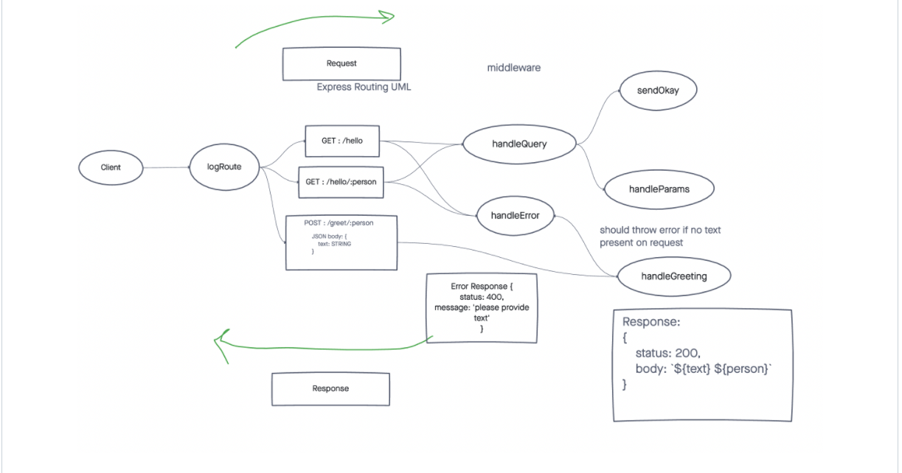

# Lab 2 - Javascript401d46

## Basic-Express-Server

### Author: Michael Campbell

#### Description: 
- Simple express server that uses a Get method from a Path/person.
-  Capable of  

#### Links:
[Heroku](https://mc-express-server.herokuapp.com/)
[repo](https://github.com/MichaelCampbell-on3001/basic-express-server)

#### Pull Request
[DEV](https://github.com/MichaelCampbell-on3001/basic-express-server/pull/1)
[also dev](https://github.com/MichaelCampbell-on3001/basic-express-server/pull/2)
[syntax error fixed](https://github.com/MichaelCampbell-on3001/basic-express-server/pull/4)

### Setup
**Dependencies:**
- dotenv
- express
- jest
- nodemon
- supertest

#### Running the app
- npm start
- Endpoint/ error status
      - Return error message

#### Tests
- Server Test `npm run test`

#### UML
(created with [diagrams](https://app.diagrams.net/) )

